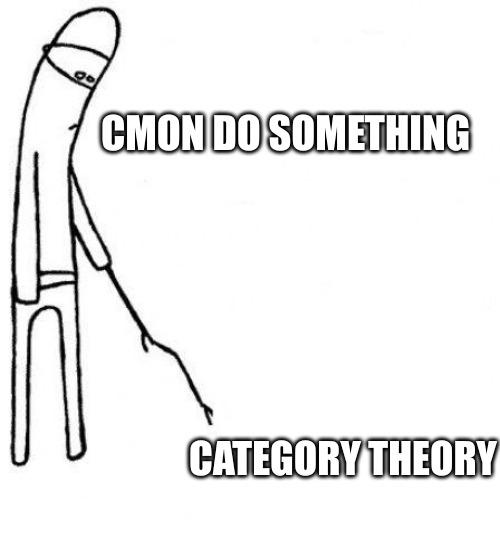

# ct_bio

Want to better understand biological systems, or organisms. [Robert Rosen](https://en.wikipedia.org/wiki/Robert_Rosen_(biologist)) had a very profound understanding, and as such I intend to get through the trilogy:

- Fundamentals of Measurement and Representation of Natural Systems (1978)
- Anticipatory Systems: Philosophical, Mathematical and Methodological Foundations (1985)
- Life Itself: A Comprehensive Inquiry into the Nature, Origin, and Fabrication of Life (1991)

which makes some use of category theory.

I have no pure math background, and so my approach will essentially be to learn as needed to understand the primary text. I will make use of the following resources, primarily:

- Category Theory for the Sciences by David Spivak
- [Seven Sketches in Compositionality: An Invitation to Applied Category Theory](https://arxiv.org/pdf/1803.05316)

A further interest is based on possibily of simulating autopoietic systems that happen to have closure to efficient causation, by the equivalence between a certain category (Cartesian Closed Categories) and λ-calculus; DOI: 10.1016/j.jtbi.2008.12.012 .